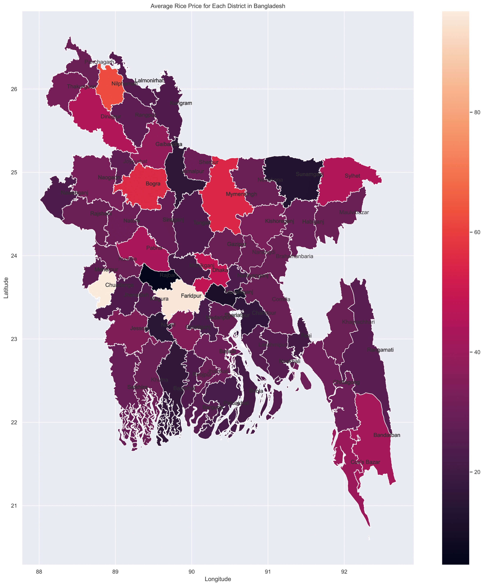

### 🌾Comprehensive Analysis of Rice Production and Pricing Trends in Bangladesh (1971-2022) 🇧🇩

Welcome to the repository for our comprehensive analysis of rice production and pricing trends in Bangladesh. This project encompasses a detailed spatiotemporal study, geospatial visualizations, and predictive modeling to offer insights into the agricultural sector's dynamics.

## Introduction
Rice is vital to Bangladesh's food security and economic growth. This repository presents a comprehensive analysis of rice production and pricing trends from 1971 to 2022. Utilizing geospatial visualization techniques and predictive modeling, we aim to provide valuable insights for policy decisions and sustainable agricultural practices.

## Datasets
- **Rice Production Data**: From Bangladesh Rice Research Institute, covering 1971-72 to 2019-20.
- **Rice Price Data**: From the Department of Agriculture Marketing, Ministry of Agriculture, covering 2010 to 2022.

## Geospatial Visualization
We used heat maps and chloropleth maps to analyze the spatial distribution and temporal trends in rice production and pricing.



## Comparative Analysis
We performed comparative analyses using line graphs to depict year-wise production and pricing trends for Aus, Aman, and Boro rice varieties.

## Predictive Modeling
We employed various models, including GridSearchCV, Ridge Regression, Decision Tree, and LightGBM, to predict rice prices for 2021 and 2022.

## Results and Discussion
Our findings highlight significant regional variations in rice production and pricing, underscoring the importance of spatial factors in policy-making. The predictive models demonstrated high accuracy, showcasing their practical application potential.

## Conclusion
This study offers deep insights into the dynamics of rice production and pricing in Bangladesh. The results can guide future research and policy-making, contributing to sustainable development goals.

## How to Use
1. **Clone the Repository**:
   ```bash
   git clone https://github.com/errhythm/RiceProductionTrendsBD.git
   ```
2. **Install Dependencies**:
   ```bash
   pip install -r requirements.txt
   ```
3. **Run the Analysis**:
   ```bash
   python main.py
   ```

## Contributors
- **Ehsanur Rahman Rhythm** (BRAC University, Bangladesh) - [Email](mailto:errhythm.me@gmail.com)

### ⚠️ Caution
The entire codebase in this repository was developed solely by me. If you encounter anyone else claiming this work as their own, please be aware that it is an act of plagiarism.

If you would like more details, please refer to the full report.
